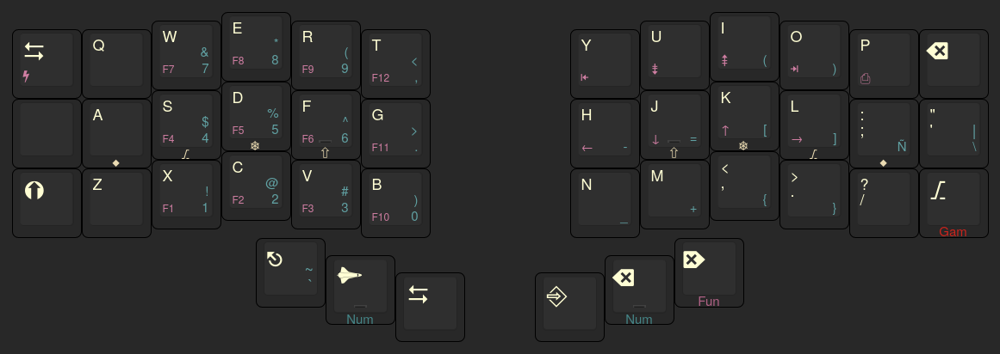

# repparw's Cantor QMK Keymap

This repository contains my personal [QMK](https://qmk.fm/) keymap configuration for the [Cantor](https://github.com/diepala/cantor) keyboard, which is a split 3x6 keyboard with 3 thumb keys per side.

It is set up as a [QMK External Userspace](https://docs.qmk.fm/newbs_external_userspace) and uses GitHub Actions to automatically build the firmware when relevant code changes are pushed.

## Layout Overview

This is the general layout structure. For the exact keycodes and definitions, please refer to the `keyboards/cantor/keymaps/repparw/keymap.c` file.



## Layers

This keymap utilizes multiple layers for functionality:

* **Base Layer (`_BL`)**: Default layer with a QWERTY layout. Features Home Row Mods and One-Shot modifiers on the bottom row corners.
* **Number Layer (`_NL`)**: Accessed by holding the left thumb Space key or the inner right thumb Backspace key. Contains numbers (numpad-like arrangement on the right hand), common programming symbols (`=`, `-`, `+`, `_`), and brackets.
* **Function Layer (`_FL`)**: Accessed by holding the outer right thumb Delete key. Contains F-keys (F1-F12), navigation keys (Arrows, Home/End, PgUp/PgDn), PrintScreen, and a toggle key for the Game Layer.
* **Game Layer (`_GL`)**: Toggled ON/OFF using the `TG(_GL)` key found on the Function layer (bottom right key on the right hand). Provides a standard gaming cluster (Ctrl, Shift, WASD) on the left hand, sacrificing the home row mods on that side for reliable gaming input.

## Key Features

* **Home Row Mods:** Standard modifiers (Shift, Ctrl, Alt, GUI) are placed on the home row keys. They act as the normal letter when tapped quickly and as the modifier when held down.
    * *Left Hand:* `A`(GUI), `S`(Alt), `D`(Ctrl), `F`(Shift)
    * *Right Hand:* `J`(Shift), `K`(Ctrl), `L`(Alt), `;`(GUI)
* **Layer Tap (`LT`):** Thumb keys activate layers when held and send their primary keycode (Space, Backspace, Delete) when tapped.
    * `NL_SPC`: Hold for `_NL` layer, Tap for `KC_SPC`.
    * `NL_BSPC`: Hold for `_NL` layer, Tap for `KC_BSPC`.
    * `FL_DEL`: Hold for `_FL` layer, Tap for `KC_DEL`.
* **One-Shot Mods (`OSM`):** Tap the bottom-left Shift key or bottom-right AltGr key once to make it act as a modifier for only the *next* key pressed.
    * `ONESHOT_TAP_TOGGLE = 3`: Tapping an OSM key 3 times toggles it on/off.
    * `ONESHOT_TIMEOUT = 30000`: OSM keys time out after 30 seconds if not used.
* **Tap-Hold Configuration:** `TAPPING_TERM` is set to 180ms (defined in `config.h`). This determines how long a key must be held to register as a hold action (for Layer Taps and Mod Taps).
* **Mod-Tap Escape (`QK_GESC`):** The innermost left thumb key sends `Escape` on tap and `Left GUI` on hold.

## Building the Firmware

### GitHub Actions (Recommended)

This repository is configured with GitHub Actions. Firmware is automatically built whenever changes are pushed to relevant files (keymap code, `qmk.json`, workflow file).

You can download the latest compiled firmware (`.uf2` or `.hex` file) directly from the **[Releases page](https://github.com/repparw/cantor/releases)**.

### Local Build

If you have a [QMK build environment set up](https://docs.qmk.fm/newbs/newbs_getting_started) and have configured this repository as your external userspace overlay (`qmk config user.overlay_dir=/path/to/repparw/cantor`), you can compile locally using:

```bash
qmk compile -kb cantor -km repparw
